# Raspberry Pi 5 Tank with STACK-CHAN

This repository describes a robotics platform that combines:

- an **ESP32-based tank** as the motion controller
- a **Raspberry Pi 5** as the high-level master controller
- **STACK-CHAN** as the interactive user interface

At the current stage, this repository is project documentation only and does not contain implementation code yet.

## Project Overview

The goal is to build a modular smart tank system where low-level motor control is handled by ESP32, while Raspberry Pi 5 provides higher-level orchestration and AI-capable logic. STACK-CHAN serves as the interaction layer for expressive, human-friendly communication.

## Tank Body (Images 1-8)

The following photos document the ESP32 tank body, chassis layout, and assembly details.

### 1) Tank Image 1
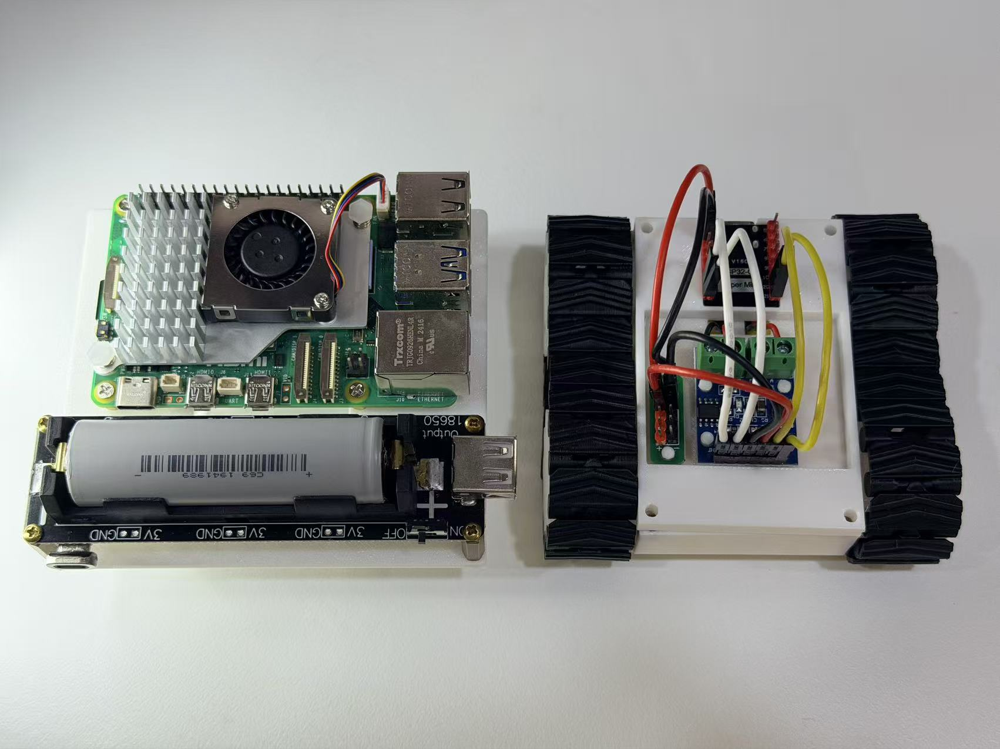

### 2) Tank Image 2
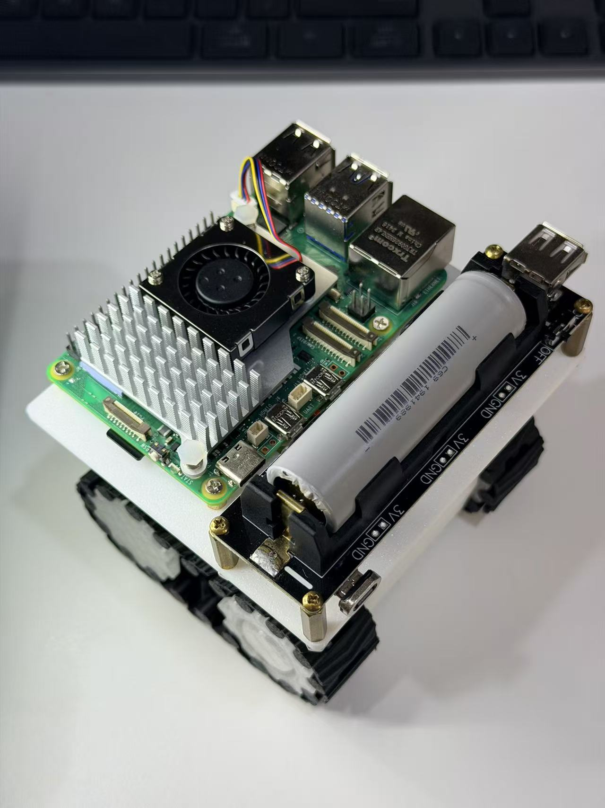

### 3) Tank Image 3
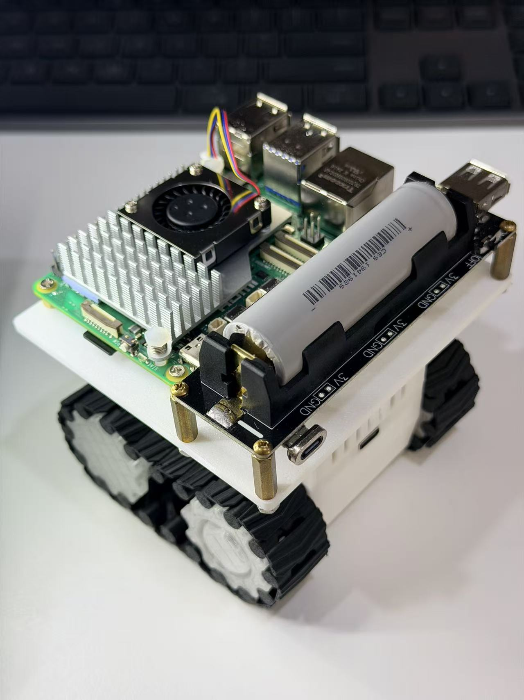

### 4) Tank Image 4
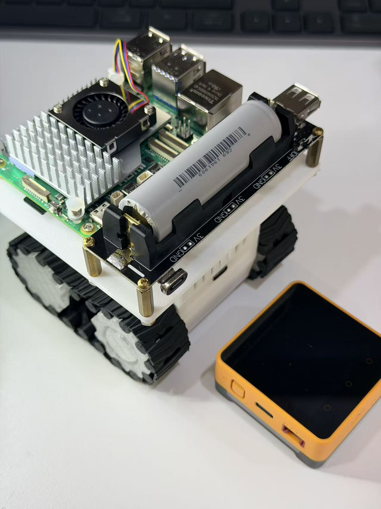

### 5) Tank Image 5
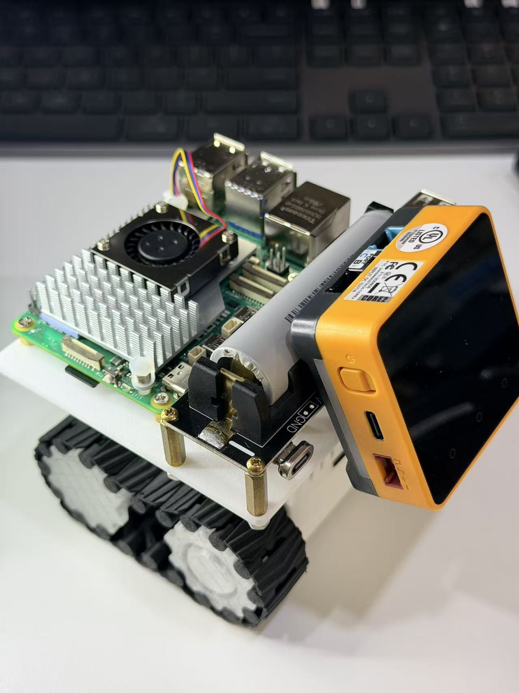

### 6) Tank Image 6
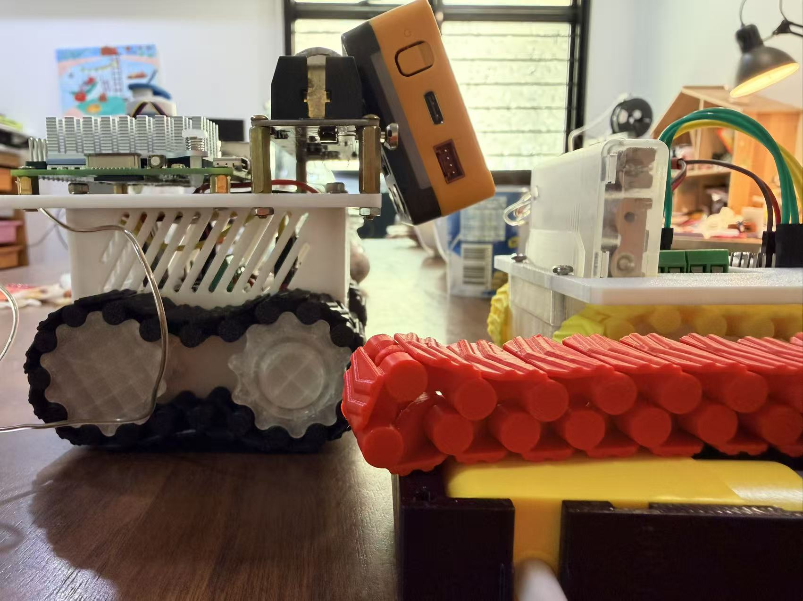

### 7) Tank Image 7
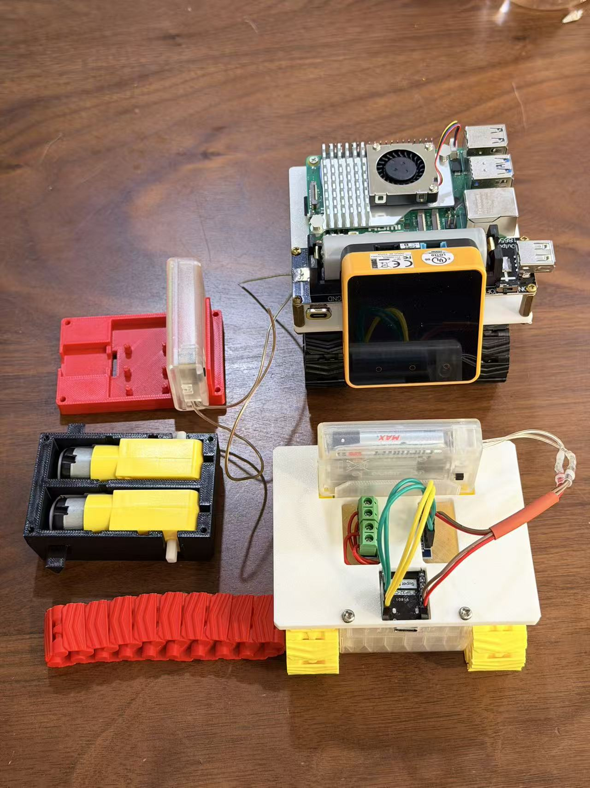

### 8) Tank Image 8
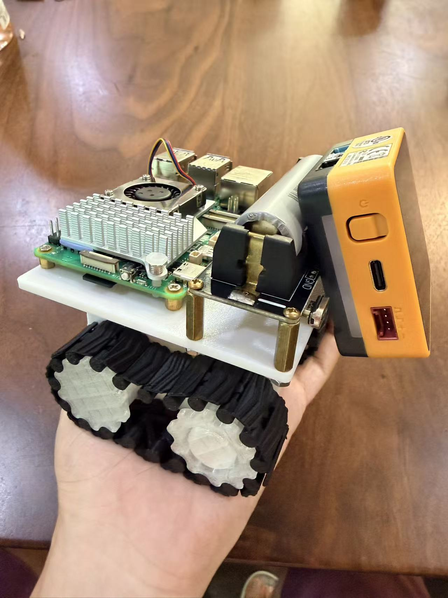

## ESP32 Soldering Helper Tool (Images 12-14)

These images show a small helper tool used during ESP32 soldering and board preparation.

### 12) Tool Image 12
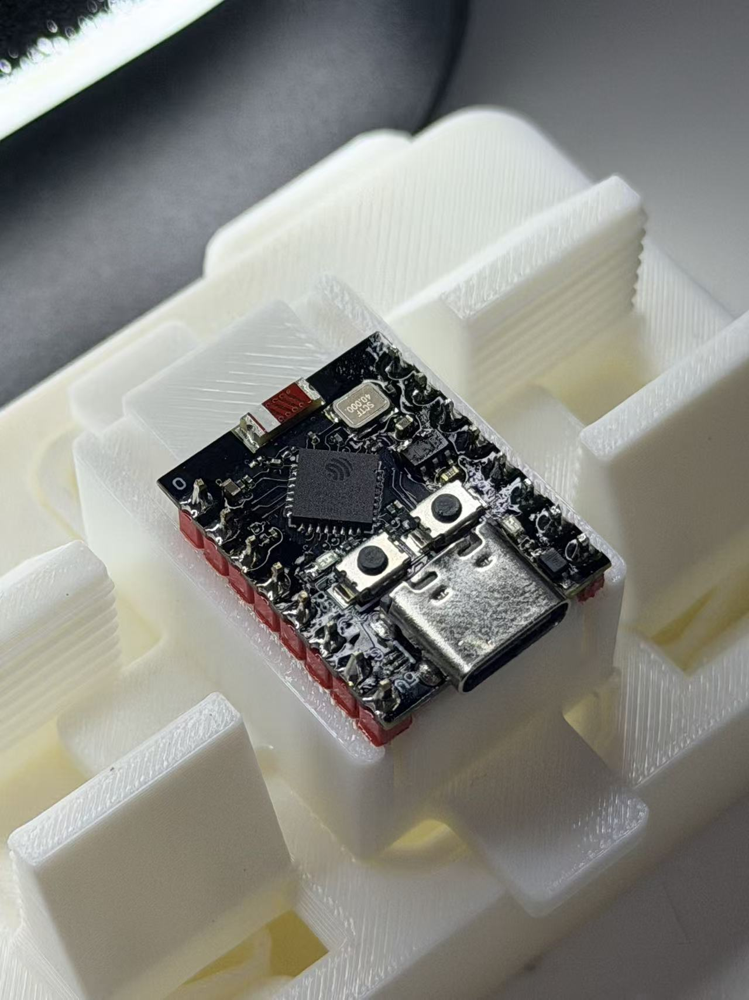

### 13) Tool Image 13
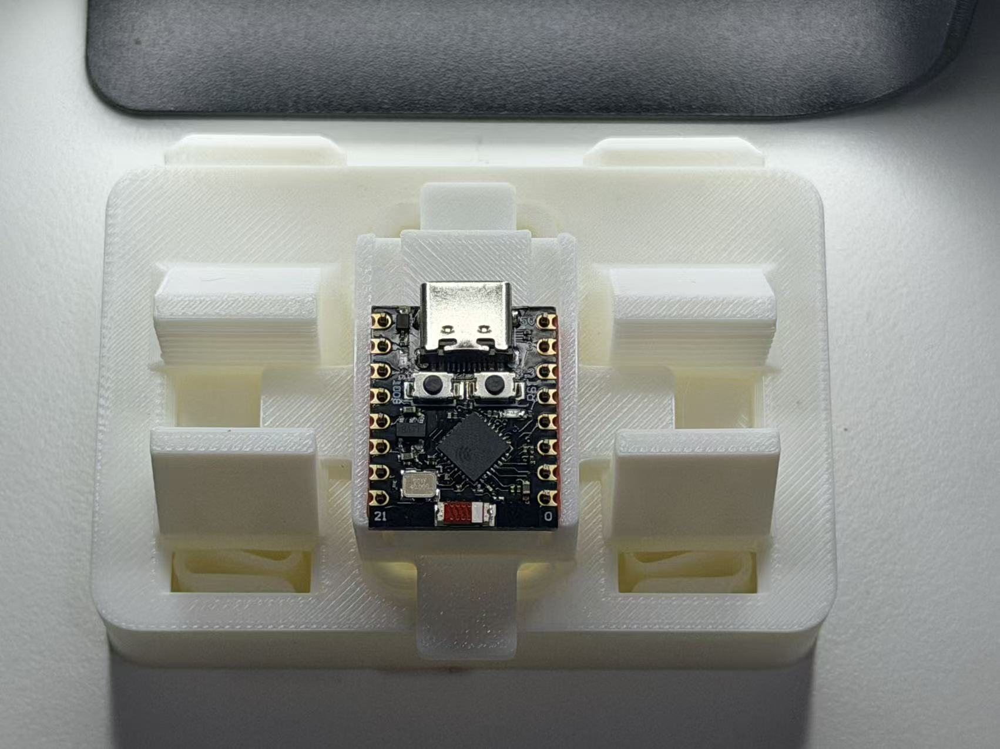

### 14) Tool Image 14
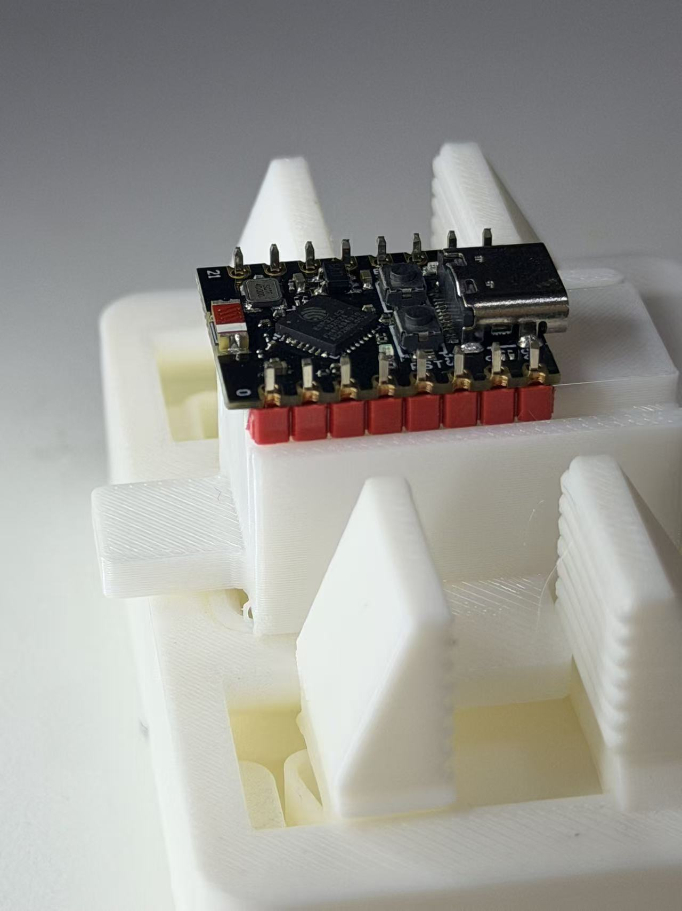

## System Architecture

- **ESP32 Tank Layer**
  - Real-time motion control
  - Motor driver interfacing
  - Basic actuator and sensor signal handling

- **Raspberry Pi 5 Master Layer**
  - Mission and state management
  - Multi-module coordination
  - Future AI, vision, and voice integration

- **STACK-CHAN Interaction Layer**
  - Conversational front-end
  - Character-style interaction and feedback
  - User-facing command and status interface

## Hardware Scope

The hardware setup for this project is centered around:

- Raspberry Pi 5 (master controller)
- ESP32 development board (tank-side controller)
- Tank chassis with dual DC motors
- Motor driver board (for example TB6612 or L298N)
- Power system (battery pack and power regulation)
- STACK-CHAN-compatible hardware modules
- Optional peripherals: camera, ultrasonic sensor, IMU, servos

## Project Status

- Documentation phase
- Hardware architecture defined
- Software implementation pending

## Roadmap (Planned)

- Define Pi5 <-> ESP32 communication protocol
- Implement tank motion command pipeline
- Integrate STACK-CHAN interaction flows
- Add sensor fusion and autonomous behaviors
- Add vision and voice-assisted control features

## Contributing

Issues and pull requests are welcome.
